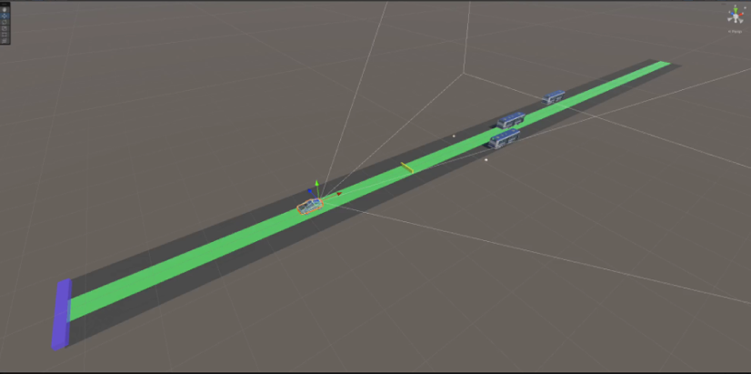
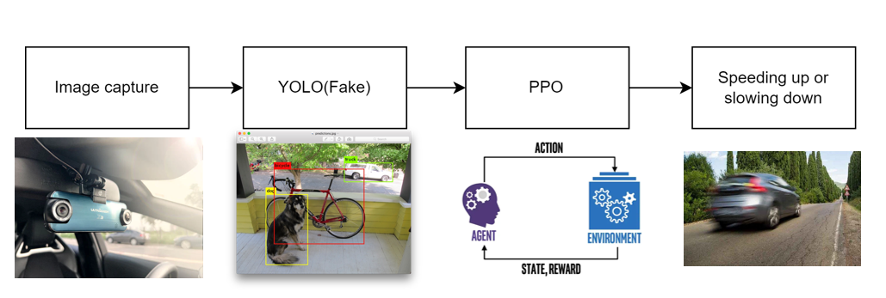
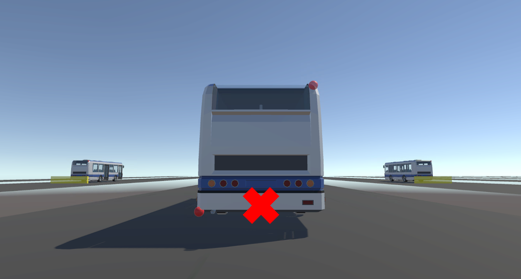

# Keep a saft distance
NTNU Reinforcement Class Resources and Keep a Saft distance(FinalProject)

### Result

you can see the result video and PowerPoint at the [GoogleDrive](https://drive.google.com/drive/folders/1O0bscrki1WSk_qIlONhCTjL-aP4DEWPL?usp=share_link).  

### Requirements

install Unity LTS [2021.3.14f1](https://unity.com/releases/editor/qa/lts-releases)  
(install Unity > LTS 2021.3.14f1 not recommended)  

install Python, Pytorch, CUDA, and Unity ML-agent from [here](https://youtu.be/zPFU30tbyKs?t=82)   

### Run

```
git clone https://github.com/Ghostly0328/NTNU-Reinforcement    
cd FinalProject
```

Open RL_FinalProject folder from Unity, click the play button and enjoy.

### What I did?



i created a scene in the Unity environment with the function to keep a safe distance from vehicles in front of you by using images.  


the whole project  is to take photos to get the current situation in front of me, Then use yolo for vehicle inspection to get the car's coordinates.
ppo will only know the vehicle coordinates from yolo value (according to the image to get the coordinates are not the world coordinates), and then according to the coordinates to calculate whether to accelerate or decelerate.  

#### PPO

- **Observation**: 
  - Current speed
  - Car position (The position is based on the x and y of the YOLO output)  
- **Actions(Continuous)**:  
  - Speed up (1 to 0)  
  - Slow down (0 to -1)  
- **Reward**:
  - +0.005 if in the yellow box
  - -0.001 if not in the yellow box
  - -1 at car accident

### Tips

    

- The position of the vehicle I set on the picture of the red dot.   
- According to this [paper](https://hdl.handle.net/11296/nurgsx), you can use the distance between the base of the vehicle and the bottom of the picture to calculate the actual distance length.  
- I have tried to give other things such as the area of the bound box but the effect is not good, when the vehicle is too far away will not be distinguished. The use of the car base marker not only improves the effect, but can also have the same effect if the vehicles are different in size or type.  
